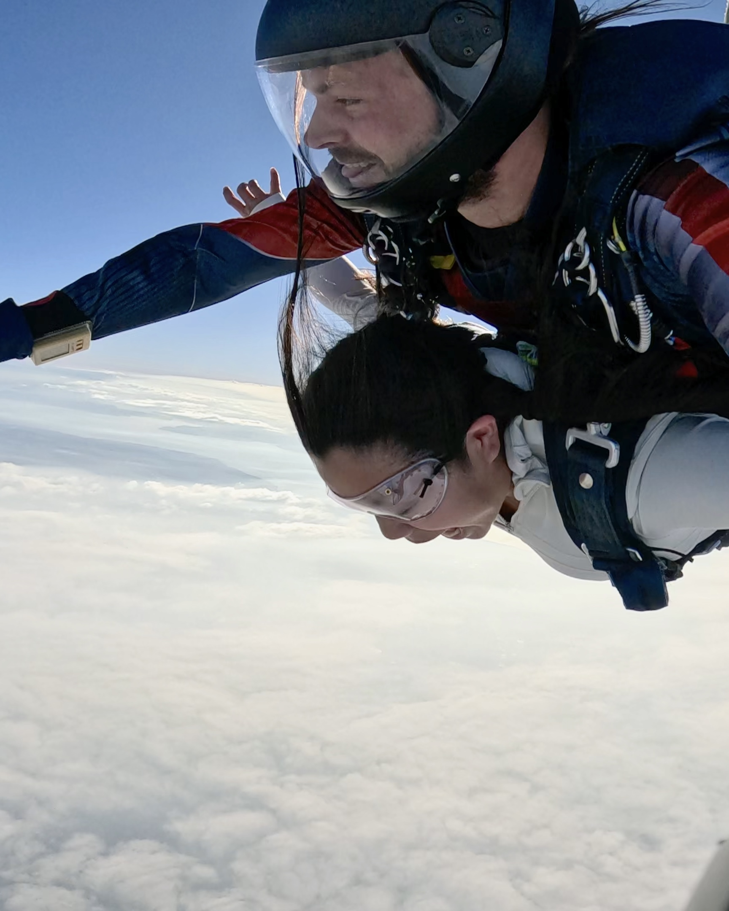
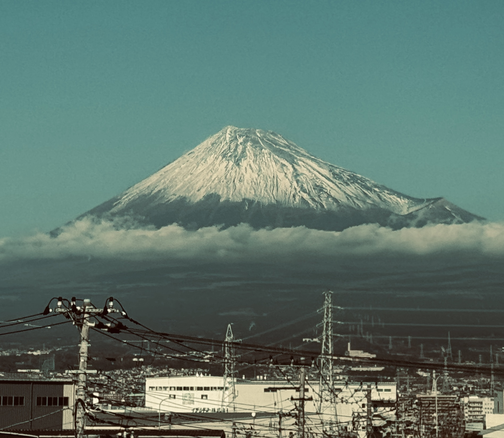
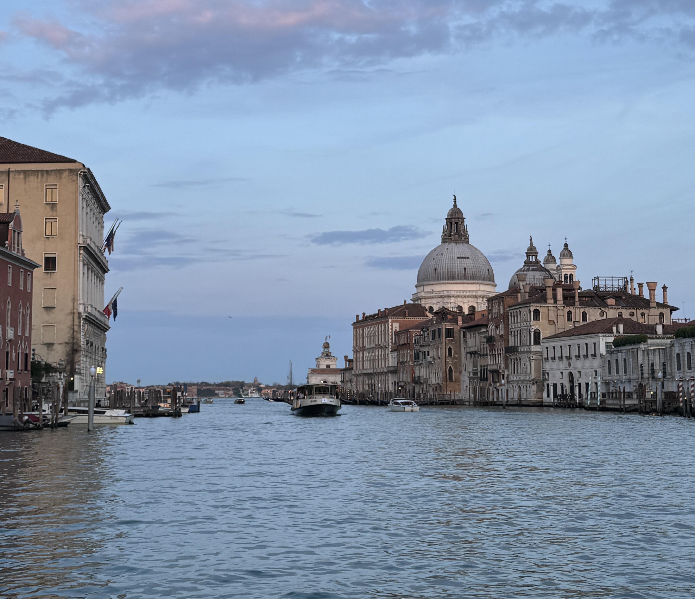

I have put together some of my relics from my travels. As you can see, I love anything related to the water, both swimming in it and just taking pictures of it. When I travel, I constantly believe in trying new things - as proof of that I have attached a picture of me skydiving (something my roommate had to convince me to do with her, but if you never try how do you know you wont like it!).

::: {layout-ncol="2"}
**8/14/2025 - Hawaii**

**3/13/2025 - Cancun**

**5/16/2024 - Universal**

**5/14/2025 - Slovenia**

**5/17/2025 - Dubrovnik**

**6/14/2025 - Seattle**

**6/29/2025 - Olympic National Park**

**12/20/2025 - Mount Fuji**

**3/14/2026 - Venice**
:::

And I could never forget my giant puppy

